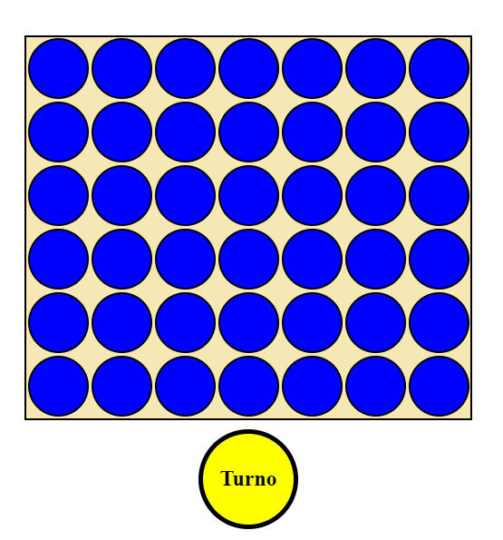

# Conecta 4

Este es un proyecto de **Conecta 4** desarrollado durante el primer año del curso de **Desarrollo de Aplicaciones Web (DAW)**.  
El juego implementa lógica para un modo Jugador vs Jugador (JvJ) y un modo Jugador vs IA.

  

## Funcionalidades
- **Modo Jugador vs Jugador (JvJ):** Dos jugadores pueden competir alternando turnos.
- **Modo Jugador vs IA:** El jugador puede enfrentarse a una IA que simula movimientos básicos.
- **Indicador de Turno:** Muestra visualmente el turno actual con colores.
- **Reinicio de Partida:** Permite reiniciar el tablero para jugar nuevamente.
- **Sombreados Interactivos:** Destaca la posición donde se colocará la ficha al pasar el mouse.
- **Detección de Ganador:** Identifica automáticamente al ganador con una secuencia de cuatro fichas consecutivas (horizontal, vertical o diagonal).

## Tecnologías Utilizadas
- **HTML5:** Para la estructura del proyecto.
- **CSS3:** Para el diseño y la presentación visual.
- **JavaScript:** Para la lógica del juego y las interacciones dinámicas.

## Cómo Jugar
1. **Selecciona un modo de juego:**
   - *Jugador vs Jugador (JvJ):* Pulsa el botón verde.
   - *Jugador vs IA:* Pulsa el botón rojo.
2. Coloca las fichas por turnos hasta obtener una línea de 4 consecutivos o hasta que el tablero se llene.
3. Si ganas, un mensaje indicará el ganador y podrás reiniciar la partida.

## Estructura del Proyecto
- `index.html`: Estructura principal del juego.
- `Conecta.css`: Estilos para el diseño visual del proyecto.
- `Conecta.js`: Lógica del juego, detección de ganador e interacción de la IA.

## Notas
- **Propósito educativo:** Este proyecto fue desarrollado como una actividad práctica en el curso DAW.

## Créditos
Samuel Moniz Pereira

## Licencia

Este proyecto está bajo la [Licencia MIT](https://opensource.org/licenses/MIT). Puedes usar, copiar, modificar y distribuir el software bajo las condiciones de esta licencia. Para más detalles, consulta el archivo [LICENSE](LICENSE) en la raíz del proyecto.

### Resumen de la Licencia MIT
La Licencia MIT es una de las licencias de software más permisivas y ampliamente utilizadas. Permite a los usuarios hacer casi cualquier cosa con tu proyecto, siempre que incluyan la misma licencia en cualquier copia o modificación del software. Esto incluye:

- Usar el software para cualquier propósito.
- Hacer copias del software.
- Modificar el software y distribuir versiones modificadas.
- Incluir el software en proyectos comerciales.

### Limitación de Responsabilidad
Este software se proporciona "tal cual", sin garantía de ningún tipo, expresa o implícita, incluyendo, pero no limitado a, las garantías de comerciabilidad, adecuación para un propósito particular y no infracción. En ningún caso los autores o titulares de derechos de autor serán responsables de ninguna reclamación, daño u otra responsabilidad, ya sea en una acción de contrato, agravio o de otro tipo, que surja de o en conexión con el software o el uso u otros tratos en el software.
